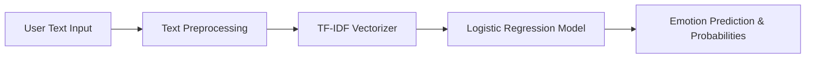

# 🎭 AI Mood & Emotion Classifier

[](https://mood-daily-prediction-ai.streamlit.app/))
[](https://www.python.org/)
[](https://scikit-learn.org/)
[](LICENSE)

An intelligent Machine Learning web application built with **Streamlit**, **Scikit-Learn**, and **TF-IDF Vectorization** to detect, classify, and analyze emotional tones from text input in real-time.

---

## ✨ Features

- 🎭 **Multi-Class Emotion Detection**: Predicts 6 core human emotions: **Sadness, Joy, Love, Anger, Fear, and Surprise**.
- 📊 **Confidence Scores & Breakdown**: Displays full probability distribution across all emotion classes with interactive visual progress bars.
- ⚡ **Real-Time Analysis**: Instant text cleaning, normalization, and predictions.
- 💡 **Quick Presets**: Preset sample buttons for fast testing and demonstration.
- 🎨 **Modern Glassmorphic UI**: Custom-styled UI with smooth gradients, responsive design, and dynamic emojis.

---

## 🛠️ Machine Learning Pipeline



1. **Preprocessing**: Normalizes text into lowercase, strips punctuation, removes digits & non-ASCII characters.
2. **Vectorization**: Transforms text into numerical feature vectors using **TF-IDF** (Term Frequency-Inverse Document Frequency).
3. **Classification**: Evaluates feature vectors using a trained **Logistic Regression** model (~89% Accuracy).

---

## 📊 Supported Emotions

| Emotion | Emoji | Description |
| :--- | :---: | :--- |
| **Joy** | 😊 | Happy, cheerful, or fulfilled feelings |
| **Sadness** | 😢 | Down, melancholy, or disappointed feelings |
| **Love** | ❤️ | Affectionate, warm, or compassionate feelings |
| **Anger** | 😡 | Frustrated, annoyed, or enraged feelings |
| **Fear** | 📁 | Anxious, nervous, or threatened feelings |
| **Surprise** | 😮 | Astonished, amazed, or startled feelings |

---

## 📁 Project Structure

```text
ai-ml code/
├── app.py                  # Main Streamlit web app
├── streamlit_app.py        # Deployment entrypoint wrapper
├── mood-predict.ipynb      # Model training & EDA notebook
├── logistic_model.pkl      # Trained Logistic Regression model
├── tfidf_vectorizer.pkl    # Trained TF-IDF vectorizer
├── emotion_mapping.pkl     # Target label encoder dictionary
├── train.txt               # Dataset used for training
├── requirements.txt        # Python dependencies
└── README.md               # Project documentation
```

---

## 🚀 Quick Start (Local Setup)

### 1. Clone the repository
```bash
git clone https://github.com/oye-rahul/mood-daily-prediction.git
cd mood-daily-prediction
```

### 2. Create a virtual environment & install dependencies
```bash
python -m venv .venv
# On Windows:
.venv\Scripts\activate
# On Mac/Linux:
source .venv/bin/activate

pip install -r requirements.txt
```

### 3. Run the Streamlit App
```bash
streamlit run app.py
```

The app will launch locally at `http://localhost:8501`.

---

## 📦 Deployment

This app is optimized for 1-click deployment on **Streamlit Community Cloud**:
1. Push this repository to GitHub.
2. Connect your repo on [Streamlit Cloud](https://share.streamlit.io/).
3. Set Main file path as `app.py` or `streamlit_app.py`.
4. Deploy!

---

## 📄 License

Distributed under the MIT License. See `LICENSE` for more details.
